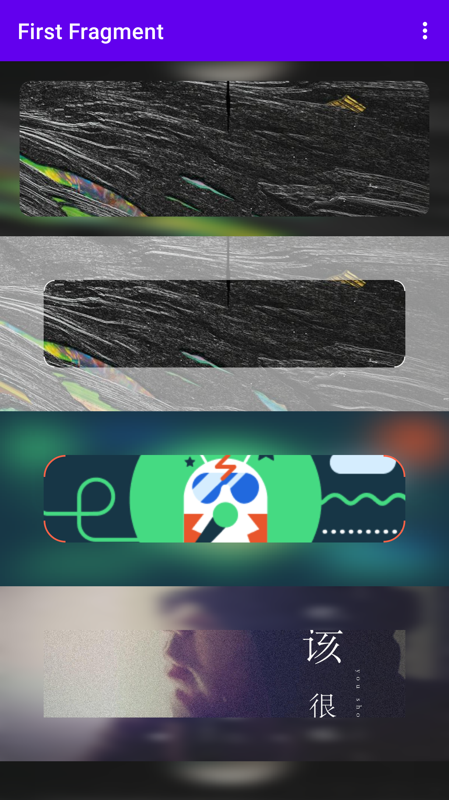

# android hollowout drawable

镂空遮罩图层库是为了适配网易云Video的封面时看到有一层图层，且转角还画了线，没有找到好的方案就自己写成了库




# Usage

repositories add `mavenCentral()`

```groovy
implementation "com.xuie0000:hollowout.drawable:1.0.0"
```

## 属性介绍

Attribute | Type | Default


# References

https://zhuanlan.zhihu.com/p/329825945